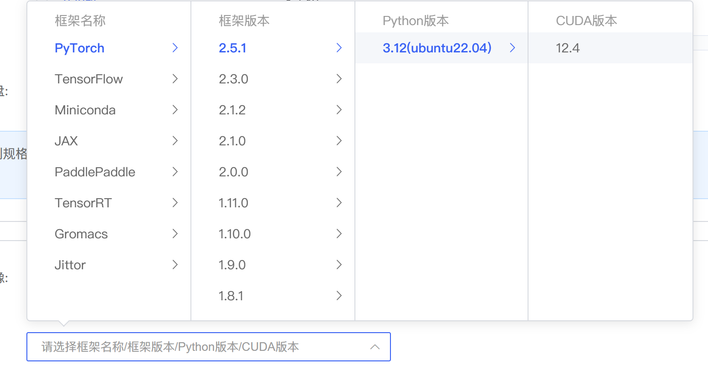
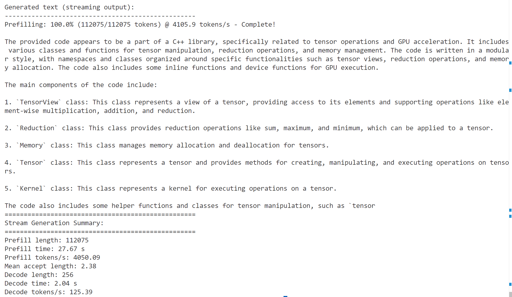
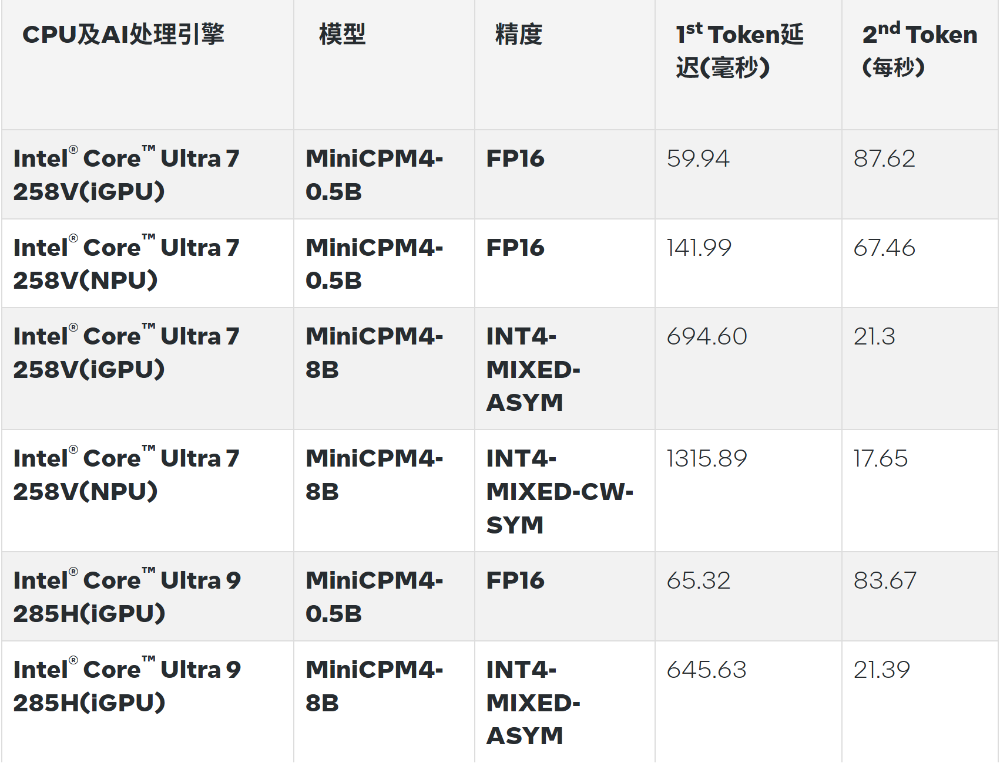
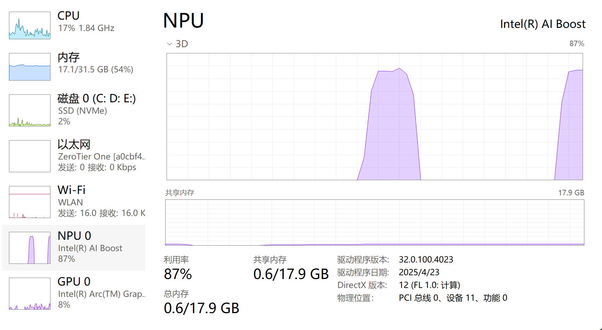

# MiniCPM4 部署教程

## MiniCPM4 模型介绍

MiniCPM 4 是一个极致高效的端侧大模型，从模型架构、学习算法、训练数据与推理系统四个层面进行了高效优化，实现了极致的效率提升。

- 🏗️ 高效模型架构：
  - InfLLM v2 -- 可训练的稀疏注意力机制：采用可训练的稀疏注意力机制架构，在 128K 长文本处理中，每个词元仅需与不足 5% 的词元进行相关性计算，显著降低长文本的计算开销
- 🧠 高效学习算法：
  - 模型风洞 2.0 -- 高效 Predictable Scaling：引入下游任务的 Scaling 预测方法，实现更精准的模型训练配置搜索
  - BitCPM -- 极致的三值量化：将模型参数位宽压缩至 3 值，实现模型位宽 90% 的极致瘦身
  - 高效训练工程优化：采用 FP8 低精度计算技术，结合多词元预测（Multi-token Prediction）训练策略
- 📚 高知识密度训练数据：
  - UltraClean -- 高质量预训练数据的清洗与合成：构建基于高效验证的迭代式数据清洗策略，开源高质量中英文预训练数据集 [UltraFineweb](https://huggingface.co/datasets/openbmb/Ultra-FineWeb)
  - UltraChat v2 -- 高质量有监督微调数据合成：构建大规模高质量有监督微调数据集，涵盖知识密集型数据、推理密集型数据、指令遵循数据、长文本理解数据、工具调用数据等多个维度
- ⚡ 高效推理系统：
  - CPM.cu -- 轻量级的高效CUDA推理框架：融合了稀疏注意力机制、模型量化与投机采样，充分体现MiniCPM4的效率优势
  - ArkInfer -- 跨平台部署系统：支持多后端环境的一键部署，提供灵活的跨平台适配能力


## 模型下载

MiniCPM4提供了两种参数量的模型：MiniCPM4-8B与MiniCPM4-0.5B以及其量化版本/工具版本/加速模型，本教程主要使用基础模型，详情可见下表：

| 模型类型     | 模型名称                           | 最低资源要求 | 推理支持                              | 下载地址                                                     |
| ------------ | ---------------------------------- | ------------ | ------------------------------------- | ------------------------------------------------------------ |
| 基础模型     | MiniCPM4-8B                        | 18G          | transformers / vLLM / SGLang / CPM.cu | [HF](https://huggingface.co/openbmb/MiniCPM4-8B) / [MS](https://www.modelscope.cn/models/OpenBMB/MiniCPM4-8B) |
|              | MiniCPM4-0.5B                      | 2G           | transformers / vLLM / SGLang          | [HF](https://huggingface.co/openbmb/MiniCPM4-0.5B) / [MS](https://www.modelscope.cn/models/OpenBMB/MiniCPM4-0.5B) |
| 加速模型     | MiniCPM4-8B-Eagle-FRSpec           | -            | CPM.cu / SGLang                       | [HF](https://huggingface.co/openbmb/MiniCPM4-8B-Eagle-FRSpec) / [MS](https://modelscope.cn/models/OpenBMB/MiniCPM4-8B-Eagle-FRSpec) |
|              | MiniCPM4-8B-Eagle-FRSpec-QAT-cpmcu | -            | CPM.cu                                | [HF](https://huggingface.co/openbmb/MiniCPM4-8B-Eagle-FRSpec-QAT-cpmcu) / [MS](https://www.modelscope.cn/models/OpenBMB/MiniCPM4-8B-Eagle-FRSpec-QAT-cpmcu) |
|              | MiniCPM4-8B-Eagle-vLLM             | -            | vLLM                                  | [HF](https://huggingface.co/openbmb/MiniCPM4-8B-Eagle-vLLM) / [MS](https://modelscope.cn/models/OpenBMB/MiniCPM4-8B-Eagle-vLLM) |
|              | MiniCPM4-8B-marlin-Eagle-vLLM      | -            | vLLM                                  | [HF](https://huggingface.co/openbmb/MiniCPM4-8B-marlin-Eagle-vLLM) /[ MS](https://modelscope.cn/models/OpenBMB/MiniCPM4-8B-Eagle-vLLM) |
| 量化版本     | MiniCPM4-8B-marlin-cpmcu           | 8G           | CPM.cu                                | [HF](https://huggingface.co/openbmb/MiniCPM4-8B-marlin-cpmcu) / [MS](https://modelscope.cn/models/OpenBMB/MiniCPM4-8B-marlin-cpmcu) |
|              | MiniCPM4-8B-marlin-vLLM            | 8G           | vLLM                                  | [HF](https://huggingface.co/openbmb/MiniCPM4-8B-marlin-vLLM) / [MS](https://modelscope.cn/models/OpenBMB/MiniCPM4-8B-marlin-vLLM) |
|              | MiniCPM4-8B-mlx                    | 6G           | MLX                                   | [HF](https://huggingface.co/openbmb/MiniCPM4-8B-mlx) / [MS](https://www.modelscope.cn/models/OpenBMB/MiniCPM4-8B-mlx) |
| 三元量化版本 | BitCPM4-0.5B                       | 1G           | transformers                          | [HF](https://huggingface.co/openbmb/BitCPM4-0.5B) / [MS](https://www.modelscope.cn/models/OpenBMB/BitCPM4-0.5B) |
|              | BitCPM4-1B                         | 2G           | transformers                          | [HF](https://huggingface.co/openbmb/BitCPM4-1B) / [MS](https://www.modelscope.cn/models/OpenBMB/BitCPM4-1B) |
| 工具版本     | MiniCPM4-Survey                    | 18G          | transformers / vLLM / SGLang / CPM.cu | [HF](https://huggingface.co/openbmb/MiniCPM4-Survey) / [MS](https://www.modelscope.cn/models/OpenBMB/MiniCPM4-Survey) |
|              | MiniCPM4-MCP                       | 18G          | transformers / vLLM / SGLang / CPM.cu | [HF](https://huggingface.co/openbmb/MiniCPM4-MCP) / [MS](https://www.modelscope.cn/models/OpenBMB/MiniCPM4-MCP) |

------


## Transformers推理

### 环境准备

在autodl平台中租一个**单卡4090等24G**显存的显卡机器，如下图所示镜像选择PyTorch-->2.5.1-->3.12(ubuntu22.04)-->12.4 接下来打开刚刚租用服务器的JupyterLab，并且打开其中的终端开始环境配置、模型下载和运行演示。



使用`modelscope`库进行模型下载

```bash
pip install modelscope
modelscope download openbmb/MiniCPM4-8B --local-dir ./MiniCPM4-8B
```

### 代码准备

在你的本地路径下新建infer.py文件并在其中输入以下内容：

```python
from transformers import AutoModelForCausalLM, AutoTokenizer  # 从transformers库导入所需的类
import torch  # 导入torch库，用于深度学习相关操作

torch.manual_seed(0)  # 设置随机种子以确保结果的可复现性

path = 'openbmb/MiniCPM4-8B' # 定义模型路径,可修改为您本地模型地址

device = "cuda" # 使用CUDA

tokenizer = AutoTokenizer.from_pretrained(path) # 从模型路径加载分词器

# 从模型路径加载模型，设置为使用bfloat16精度以优化性能，并将模型部署到支持CUDA的GPU上,trust_remote_code=True允许加载远程代码
model = AutoModelForCausalLM.from_pretrained(path, torch_dtype=torch.bfloat16, device_map=device, trust_remote_code=True)

# 使用模型进行聊天，提出问题并设置生成参数
messages = [
    {"role": "user", "content": "推荐5个北京的景点。"},
]

# 使用 tokenizer 的 apply_chat_template 方法将 messages 转换为模型可接受的输入格式
model_inputs = tokenizer.apply_chat_template(messages, return_tensors="pt", add_generation_prompt=True).to(device)

# 使用模型进行文本生成，并设置参数，如temperature、top_p值
model_outputs = model.generate(
    model_inputs,
    max_new_tokens=1024,
    top_p=0.7,
    temperature=0.7
)

# 提取出生成的新 token ID，排除掉原始输入部分
output_token_ids = [
    model_outputs[i][len(model_inputs[i]):] for i in range(len(model_inputs))
]

# 使用 tokenizer 将生成的 token ID 解码为自然语言文本
# skip_special_tokens=True：跳过特殊标记（如 <s>, </s>, <|assistant|> 等）
responses = tokenizer.batch_decode(output_token_ids, skip_special_tokens=True)[0]

# 输出模型生成的回复内容
print(responses)
```

### 部署

在终端输入以下命令运行infer.py，即实现MiniCPM4的Transformers部署调用

```bash
python infer.py
```

------


## CPM.cu部署

> CPM.cu 是一个针对端侧大模型推理设计的轻量、高效的 CUDA 推理框架，核心支持**稀疏架构**、**投机采样** 和**低位宽量化**等前沿技术创新，能够完全发挥 MiniCPM 4.0 的效率优势。
>
> **仓库地址**：https://github.com/OpenBMB/CPM.cu

###  环境配置

**创建conda环境**

```Bash
conda create -n minicpm
```

**下载并安装CPM.cu**

```Bash
git clone https://github.com/OpenBMB/CPM.cu.git --recursive
cd CPM.cu
pip install -e .
#构建需要一些时间，请耐心等待。
```

### 模型下载

**创建文件夹，用于存放模型**

```Bash
mkdir MiniCPM4
cd MiniCPM4
```

**下载模型**

  使用CPM.cu推理模型需要下载**基础模型**与**加速模型**，将模型权重下载至本地您创建完成的文件夹中。

```Bash
#下载基础模型
git clone https://huggingface.co/openbmb/MiniCPM4-8B-marlin-cpmcu
#下载加速模型
git clone https://huggingface.co/openbmb/MiniCPM4-8B-Eagle-FRSpec-QAT-cpmcu
```

  下载完成后，文件目录结构如下：

```Bash
MiniCPM4/
├── MiniCPM4-8B-marlin-cpmcu/
│   └── 模型权重
└── MiniCPM4-8B-Eagle-FRSpec-QAT-cpmcu/
    └── 模型权重
```

### 快速体验

```Bash
#进入CPM.cu文件夹
cd CPM.cu
#生成测试长文本
python tests/long_prompt_gen.py
#运行模型，将命令中的路径修改为您本地模型的存储路径
python tests/test_generate.py --prompt-file prompt.txt -p /your/path/MiniCPM4
```



------


## vLLM部署

### 环境配置

**安装vLLM**

```Bash
pip install vllm==0.9.1
pip install accelerate
```

###  离线推理

```Python
from transformers import AutoTokenizer
from vllm import LLM, SamplingParams

model_name = "openbmb/MiniCPM4-8B"  #可修改为您本地模型地址
prompt = [{"role": "user", "content": "推荐5个北京的景点。"}]

tokenizer = AutoTokenizer.from_pretrained(model_name, trust_remote_code=True)
input_text = tokenizer.apply_chat_template(prompt, tokenize=False, add_generation_prompt=True)

llm = LLM(
    model=model_name,
    trust_remote_code=True,
    max_num_batched_tokens=32768, 
    dtype="bfloat16", 
    gpu_memory_utilization=0.8, 
)

sampling_params = SamplingParams(top_p=0.7, temperature=0.7, max_tokens=1024, repetition_penalty=1.02)

outputs = llm.generate(prompts=input_text, sampling_params=sampling_params)

print(outputs[0].outputs[0].text)
```

**如需使用其他模型，需修改初始化推理引擎代码👇**

使用MiniCPM4-8B-Eagle-vLLM进行加速推理：

```Python
llm = LLM(
    model=model_name,
    trust_remote_code=True,
    max_num_batched_tokens=32768, 
    dtype="bfloat16", 
    gpu_memory_utilization=0.8, 
    speculative_config={
        "method": "eagle",
        "model": "openbmb/MiniCPM4-8B-Eagle-vLLM", #可修改为您本地模型地址
        "num_speculative_tokens": 2,
        "max_model_len": 32768,
    },
)
```

使用MiniCPM4-8B-marlin-vLLM量化模型：

```Python
model_name = "openbmb/MiniCPM4-8B-marlin-vLLM" #可修改为您本地模型地址
```

使用MiniCPM4-8B-marlin-Eagle-vLLM加速推理MiniCPM4-8B-marlin-vLLM量化模型：

```Python
llm = LLM(
    model="openbmb/MiniCPM4-8B-marlin-vLLM", #可修改为您本地模型地址
    trust_remote_code=True,
    max_num_batched_tokens=32768,
    dtype="bfloat16",
    gpu_memory_utilization=0.8,
    speculative_config={
        "method": "eagle",
        "model": "openbmb/MiniCPM4-8B-marlin-Eagle-vLLM", #可修改为您本地模型地址
        "num_speculative_tokens": 2,
        "max_model_len": 32768,
    },
)
```

### API 部署

  将命令中的路径修改为您本地模型的存储路径

```Bash
vllm serve /your/path/MiniCPM4-8B --dtype auto --max-num-batched-tokens 32768 --gpu-memory-utilization 0.8 --api-key token-abc123 --trust-remote-code
```

  使用Eagle模型加速（量化模型同理），将命令中的路径修改为您本地模型的存储路径:

```Bash
vllm serve /your/path/MiniCPM4-8B \
    --api-key token-abc123 \
    --trust-remote-code \
    --max-num-batched-tokens 32768 \
    --dtype auto \
    --gpu-memory-utilization 0.8 \
    --speculative-config '{"method": "eagle", "model": "/your/path/MiniCPM4-8B-Eagle-vLLM", "num_speculative_tokens": 2, "max_model_len": 32768}'
```

  API调用方法与OpenAI API一致，详情请参考[vLLM官方文档](https://docs.vllm.com.cn/en/latest/serving/openai_compatible_server.html)

------

## SGLang

### 环境配置

安装OpenBMB的SGLang分支

```Bash
git clone -b openbmb https://github.com/OpenBMB/sglang.git
cd sglang

pip install --upgrade pip
pip install -e "python[all]"
```

### 启动服务

**使用基础模型**

```Bash
python -m sglang.launch_server --model /your/path/MiniCPM4-8B --trust-remote-code --port 30000 --chat-template chatml
```

**使用Eagle模型进行加速**

```Bash
python -m sglang.launch_server --model-path /your/path/MiniCPM4-8B \ 
    --speculative_draft_model_path /your/path/MiniCPM4-8B-Eagle-FRSpec \
    --host 0.0.0.0 --trust-remote-code \
    --speculative-algorithm EAGLE --speculative-num-steps 1 --speculative-eagle-topk 1 --speculative-num-draft-tokens 2 \
    --mem-fraction 0.5
```

------

## llama.cpp

### 编译安装

####  拉取代码

```Bash
git clone https://github.com/ggml-org/llama.cpp.git
cd llama.cpp
```

#### 编译llama.cpp

> 编译得到的程序保存在`./build/bin/`

 **CPU/Metal：**

```Bash
cmake -B build
cmake --build build --config Release -j 8
```

 **CUDA:**

```Bash
cmake -B build -DGGML_CUDA=ON
cmake --build build --config Release -j 8
#新版CUDA编译时间较久，请耐心等待。
```

### 推理模型

**命令行推理**

```Bash
./llama-cli -c 1024 -m /your/path/MiniCPM4-8B-Q4_K_M.gguf -n 1024 --top-p 0.7 --temp 0.7 --prompt "<|im_start|>user\n请写一篇关于人工智能的文章，详细介绍人工智能的未来发展和隐患。<|im_end|>\n<|im_start|>assistant\n"

# 如果使用N卡，请在命令中添加 -ngl 10000 启用GPU加速
```

**API部署**

```Python
./llama-server -m /your/path/MiniCPM4-8B-Q4_K_M.gguf -c 2048

# 如果使用N卡，请在命令中添加 -ngl 10000 启用GPU加速
```

------

## 端侧部署

### Intel AIPC

 **配置参考：**

- **Intel® Core™ Ultra 5 125H**
  - iGPU Driver：32.0.101.6651
  - NPU Driver：32.0.100.4023
  - Memory: 32GB
- **Intel® Core™ Ultra 7 258V**
  - iGPU Driver：32.0.101.6790
  - NPU Driver：32.0.100.4023
  - Memory: 32GB

#### 环境配置

创建venv虚拟环境

```Bash
python -m venv venv 
./venv/Scripts/activate.bat 
```

安装依赖

```Bash
pip install --pre -U openvino-genai --extra-index-url https://storage.openvinotoolkit.org/simple/wheels/nightly 
pip install nncf
pip install git+https://github.com/huggingface/optimum-intel.git 
```

 **笔者的OpenVINO版本：**

| **openvino**         | **openvino-genai**   | **openvino-tokenizers** |
| -------------------- | -------------------- | ----------------------- |
| 2025.3.0.dev20250606 | 2025.3.0.dev20250606 | 2025.3.0.dev20250606    |

#### 模型下载与转换

下载模型（以MiniCPM4-0.5B为例）

```Bash
# Huggingface
pip install huggingface_hub
huggingface-cli download openbmb/MiniCPM4-0.5B --local-dir ./MiniCPM4-0.5B

# 魔搭社区
pip install modelscope
modelscope download openbmb/MiniCPM4-0.5B --local-dir ./MiniCPM4-0.5B
```

转换模型 (将`--model`参数修改为您下载模型的路径，结尾修改为您的模型导出路径)

```Bash
optimum-cli export openvino --model /your/path/MiniCPM4-0.5B --task text-generation-with-past --weight-format int4 --group-size 128 --ratio 0.8  --trust-remote-code ./MiniCPM4-0.5B-ov
```

 **如果您需要使用NPU进行模型推理，请使用下方命令**👇

```Bash
optimum-cli export openvino --model /your/path/MiniCPM4-0.5B --task text-generation-with-past --weight-format int4 --sym --group-size -1 --backup-precision int8_sym --trust-remote-code ./MiniCPM4-0.5B-ov-npu
```

 **参数解析：**

- **--weight-format：**量化精度，可以选择fp32, fp16, int8, int4, int4_sym_g128 ,int4_asym_g128 ,int4_sym_g64 ,int4_asym_g64
- **--group-size：**权重里共享量化参数的通道数量
- **--ratio：**int4/int8权重比例，默认为1.0，0.6表示60%的权重以int4表，40%以int8表示
- --**sym：**是否开启对称量化

####  模型推理

 示例代码：

```Python
import argparse
import openvino_genai
 
def streamer(subword):
    print(subword, end='', flush=True)
    return openvino_genai.StreamingStatus.RUNNING

def main():
    parser = argparse.ArgumentParser()
    parser.add_argument('--model_dir')
    args = parser.parse_args()
    device = 'CPU'    #推理设备，可选"CPU"&"GPU"&"NPU"

    pipe = openvino_genai.LLMPipeline(args.model_dir, device)
    config = openvino_genai.GenerationConfig()
    config.max_new_tokens = 200 #最大输出token数，可自行修改
    config.temperature = 0.7

    bos_token = "<s>"
    pipe.start_chat()
    while True:
        try:
            prompt = input('question:\n')   
        except EOFError:
            break

        prompt_with_bos = bos_token + prompt

        pipe.generate(prompt_with_bos, config, streamer)
        #如果使用NPU，请使用以下参数：
        #pipe.generate(prompt_with_bos, config, streamer,do_sample=False)
        print('\n----------')
    pipe.finish_chat()
    
 
if '__main__' == __name__:
    main()
```

 运行代码（将-`-model_dir`参数修改为您转换后的模型地址）

```Bash
python main.py --model_dir ./MiniCPM4-0.5B-ov
```



NPU推理0.5B版本，资源占用如下👇




### MLX - Apple Silicon

#### 编译安装MLX-LM

从仓库拉取镜像

```Bash
git clone https://github.com/ml-explore/mlx-lm.git
```

安装MLX-LM:

```Bash
pip install -e .
```

#### 模型下载与转换

直接下载转换好的MLX模型

```Bash
# Huggingface
pip install huggingface_hub
huggingface-cli download openbmb/MiniCPM4-8B-mlx --local-dir ./MiniCPM4-8B-mlx

# 魔搭社区
pip install modelscope
modelscope download openbmb/MiniCPM4-8B-mlx --local-dir ./MiniCPM4-8B-mlx
```

#### 模型推理

> 如果推理报错`not support minicpm4`，请修改config.json中的`"model_type": "minicpm4"`修改为`"model_type": "minicpm"`

 使用命令行：

```Bash
mlx_lm.generate --model /your/path/MiniCPM4-8B-mlx \
                --prompt "tell me a story about a robot who discovered music" \
                --max-tokens 500 \
                --temp 0.8
```

 推理代码：

```Python
from mlx_lm import load, generate

model, tokenizer = load("/your/path/MiniCPM4-8B-mlx")
prompt = "tell me a story about a robot who discovered music"
response = generate(model, tokenizer, prompt=prompt)

print(response)
```

 流式推理代码：

```Python
from mlx_lm import load, stream_generate

model, tokenizer = load("/your/path/MiniCPM4-8B-mlx")
prompt = "Tell me a story about a robot who discovered music"

for response in stream_generate(model, tokenizer, prompt=prompt):
    print(response.text, end="", flush=True)
```
